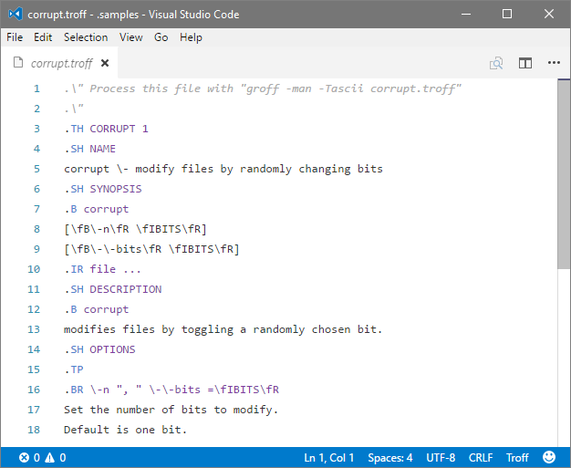

# TROFF Syntax

TROFF Syntax Highlighter for Visual Studio Code.

# Features

This extension is syntax highlighter for troff (groff, nroff) U**x document formatting system language.

# Acknowledgments

Adapted & fine-tuned to *Visual Studio Code* from *Sublime Text* extension by McFuzzypants.
